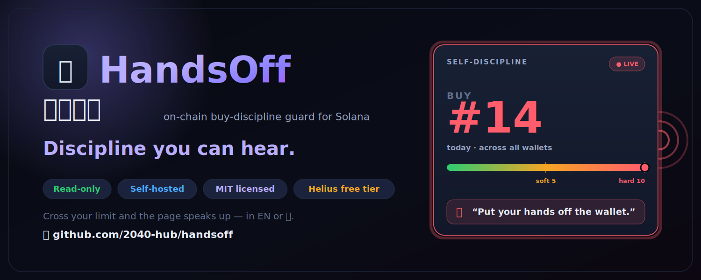
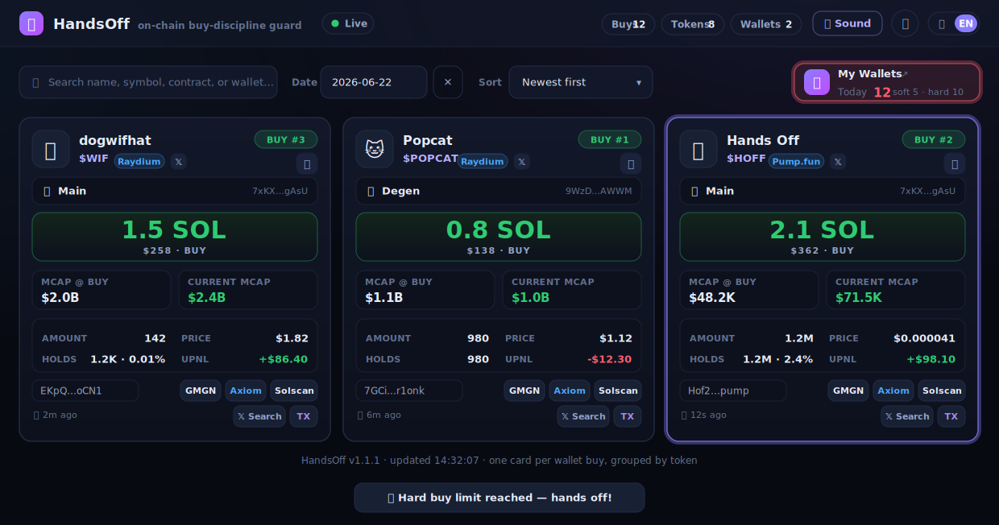
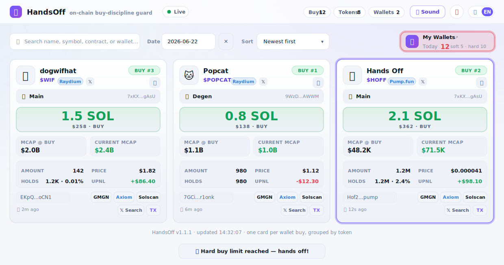
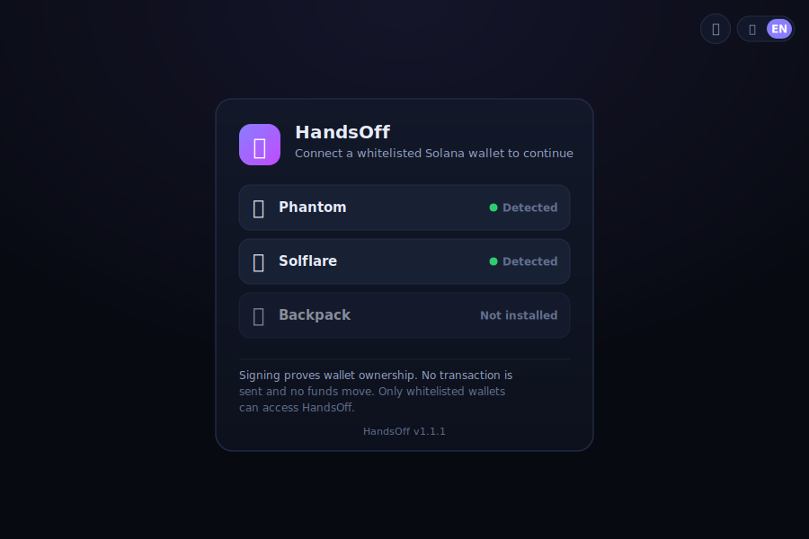

<div align="center">

# 🪓 HandsOff &nbsp;·&nbsp; 再买剁手

**An on-chain buy-discipline guard for Solana degens.**

It watches *your own* wallets through the free [Helius](https://helius.dev) RPC,
streams every BUY to a live web page as a card — and when today's buy count crosses
the line you drew, it **literally speaks up** and tells you to put your hands off the
wallet.

[](https://www.python.org/)
[](https://docs.aiohttp.org/)
[](LICENSE)
[](https://solana.com/)

[English](README.md) · [中文](README_cn.md)

<p>
  
</p>

<p>
  
</p>

</div>

---

## Why "再买剁手" (HandsOff)?

**剁手** (*duò shǒu*, "chop your hands off") is Chinese internet slang for compulsive
buying — *"if I buy again, somebody chop my hands off."* On Solana that compulsion is
the 3 a.m. ape into your 14th memecoin of the day.

HandsOff is a tiny, self-hosted **anti-FOMO buddy**. It doesn't block your trades — it
makes them impossible to ignore. Every buy lands as a card on a sleek terminal-style
page, your running daily count sits in the corner, and the moment you blow past your
**soft** and then your **hard** limit, the page speaks a reminder out loud (in English
or Chinese). Discipline you can *hear*.

> Inspired by the dedicated "Ray Onyx" wallet-buy page from a private monitor, rebuilt
> from scratch as a clean, single-purpose, **fully open-source** tool — no Telegram
> userbot, no private APIs, just a free Helius key.

---

## ✨ Features

- 🃏 **Live buy cards** — one card per wallet BUY, grouped by token, with name, symbol,
  icon, SOL/USD size, token amount, unit price, market cap at buy + current market cap,
  your resulting holdings, and one-click GMGN / Axiom / Solscan / X-search / TX links.
- 🗣️ **Soft / hard spoken reminders** — when today's *combined* buy count across your
  wallets reaches a threshold, the browser speaks a reminder via the Web Speech API. It
  starts exactly at the threshold and repeats once per further buy, with **per-day
  caps** that survive reloads, multiple tabs and restarts (each buy count is spoken at
  most once — never spammy, never duplicated).
- 🔔 **A distinct chime** for brand-new cards, with a per-token "Nth buy" window and a
  per-card mute.
- ⚡ **Millisecond updates** over Server-Sent Events, with an 8 s poll as a robust
  fallback — and a silent audio keep-alive so the chime/voice still fire while the tab
  is backgrounded (desktop).
- 🔭 **Pure free-tier Helius** — standard JSON-RPC for the hot path (1 credit/call),
  DAS `getAsset` for metadata/supply/price, and a DexScreener fallback for fresh
  pump.fun mints. No userbot, no paid plan.
- 🌗 **Tech aesthetic** — dark/light themes, bilingual UI (中 / EN), search, date filter,
  multiple sorts, responsive down to phones.
- 🔒 **Local & private** — a single SQLite file, binds to `127.0.0.1` by default, zero
  telemetry. Your keys and wallets never leave your machine.
- 🔑 **Optional wallet-whitelist login** — gate the whole UI behind a Solana wallet
  sign-in (an Ed25519 message signature — no transaction, no funds moved). Only the
  addresses you whitelist can view the page; everyone else is bounced to `/login`.

---

## 🖥️ What it looks like

Every buy lands as a card — token name, symbol, icon and platform; the buying wallet;
the SOL / USD size; **market cap at buy** + **current market cap**; your resulting
holdings and uPnL; and one-click GMGN / Axiom / Solscan / 𝕏-search / TX links. The
**self-discipline panel** (top-right) tracks today's *combined* buy count across all
your wallets and escalates: neutral → **amber** at the soft cap → **pulsing red** at
the hard cap — the exact moment the page also speaks the reminder out loud. *(The shot
above shows the dark theme with the panel already over its hard limit.)*

Same stream, light theme — one toggle away:



---

## 🚀 Quick start

### 1. Prerequisites

- **Python 3.11+** (developed & tested on **3.13.13**)
- A free **Helius API key** — sign up at <https://dashboard.helius.dev> and copy the key.

### 2. Install

```bash
cd handsoff

# (recommended) create an isolated environment
python3 -m venv venv
source venv/bin/activate          # Windows: venv\Scripts\activate

pip install -r requirements.txt
```

### 3. Configure

```bash
cp config.ini.template config.ini
```

Open `config.ini` and set at minimum:

```ini
[HELIUS]
api_key = YOUR_HELIUS_API_KEY

[WALLETS]
addresses = 95jpiZZ8PxYzq4Lfvk8Se2LHsTCMVPL9hXwZp2JBGSHm:Main,
            8Q5bHY9RHtuYcmK7i1qvmYJZN8QXYYaHi9Ruzt2y4L6P:Degen

[DISCIPLINE]
soft_buy_amount = 5
hard_buy_amount = 10
```

### 4. Run

```bash
python3 handsoff.py
# …or in the background:
bash start.sh        # logs -> handsoff.log ; stop with: bash stop.sh
```

Open **<http://127.0.0.1:8787>**. Click anywhere once to unlock sound (browsers require
a user gesture before they'll speak), and you're live.

> **First run is silent on purpose.** HandsOff records where each wallet's history
> currently ends and only cards *new* buys from then on — it won't replay your back
> catalogue. (Set `seed_silent = false` to card recent history on first launch.)

---

## ⚙️ Configuration reference

All settings live in `config.ini`. Sensible defaults mean you usually only touch
`[HELIUS] api_key`, `[WALLETS] addresses`, and the `[DISCIPLINE]` limits.

### `[HELIUS]`

| Key | Default | Description |
|---|---|---|
| `api_key` | — | **Required.** Your Helius API key (free plan is plenty). |
| `rpc_url` | `https://mainnet.helius-rpc.com` | Optional RPC base override (any Solana RPC works). |
| `poll_interval` | `25` | Seconds between polling each wallet (min 5). |
| `signatures_limit` | `25` | Signatures fetched per poll page (1–100). |
| `max_pages_per_poll` | `4` | Pages to walk if a wallet is very active between polls. |
| `metadata_ttl` | `86400` | Seconds a token's cached name/symbol/icon/supply stays fresh. |
| `price_ttl` | `300` | Seconds a token's cached price/market-cap stays fresh. |
| `price_refresh_interval` | `300` | How often to refresh current market caps for recently-active tokens. |
| `seed_silent` | `true` | Skip back-history on first run (no card flood). |
| `min_sol_amount` | `0.0001` | Ignore "buys" smaller than this many SOL (dust/fee noise). |

### `[WALLETS]`

| Key | Description |
|---|---|
| `addresses` | Comma-separated `ADDRESS:nickname` pairs — **your** wallets. Nickname is optional. The self-discipline count is the **combined** buys across all of them today. |

### `[DISCIPLINE]`  — the point of the whole thing

| Key | Default | Description |
|---|---|---|
| `soft_buy_amount` | `5` | Gentle "stay disciplined" reminder threshold (0 = off). |
| `hard_buy_amount` | `10` | Firm "hands off!" threshold (0 = off). |
| `soft_max_alerts` | `0` | Max soft plays per day (**0 = unlimited**). |
| `hard_max_alerts` | `0` | Max hard plays per day (**0 = unlimited**). |
| `enable_duplicate_buy` | `true` | Should buying the **same token (CA)** again today count again? `true` (default) — every buy counts, so 3 buys of one CA add **3**. `false` — each distinct CA counts **once**, so re-entering a position you already hold can't push you toward the limit; only **new** tokens do. |
| `label` | auto | Panel label (defaults to the single wallet's nickname, or "My Wallets"). |
| `panel_url` | auto | GMGN link the panel opens (defaults to the first wallet). |

### `[CHIME]`

| Key | Default | Description |
|---|---|---|
| `enabled` | `true` | Play the new-card chime. |
| `start_seq` | `1` | Ring starting at the Nth buy of a token. |
| `max` | `5` | Ring at most this many times per token. |

### `[WEB]`

| Key | Default | Description |
|---|---|---|
| `host` | `127.0.0.1` | Bind address. **Keep loopback** unless you enable wallet login below (or add your own proxy/auth). |
| `port` | `8787` | Web UI port. |
| `db_path` | `handsoff.db` | SQLite file (buy cards + voice ledger). |
| `enable_auth` | `false` | Gate the UI behind a Solana-wallet whitelist login (see [Wallet login](#-wallet-login-optional)). |
| `whitelist_wallet_lists` | — | Comma-separated allow-list of wallet addresses. Empty + `enable_auth=true` = nobody can sign in. |
| `session_secret` | — | Secret that signs session tokens. **Required** when `enable_auth=true` (≥16 random chars). Generate: `python3 -c "import secrets; print(secrets.token_urlsafe(48))"` |
| `session_ttl` | `604800` | Session lifetime in seconds (default 7 days). |
| `nonce_ttl` | `300` | Sign-in challenge (nonce) lifetime in seconds. |

### `[GENERAL]`

| Key | Default | Description |
|---|---|---|
| `log_level` | `INFO` | `DEBUG` / `INFO` / `WARNING` / `ERROR`. |

---

## 🗣️ How the self-discipline voice works

The voice is the heart of HandsOff, and it's engineered to be **helpful, not annoying**:

1. **It arms at the threshold.** The first reminder plays the moment today's combined
   buy count *equals* `soft_buy_amount` (then again at `hard_buy_amount`).
2. **It repeats once per further buy** — every additional ape past the line nags you
   again, so the pressure ramps up exactly when you're losing control.
3. **It never repeats the same count.** Reload the page, open three tabs, restart the
   process at 2 a.m. — a given buy count is spoken **at most once**. The play ledger is
   persisted in SQLite and the count is recomputed and claimed atomically server-side.
4. **Per-day caps.** `soft_max_alerts` / `hard_max_alerts` limit how many times each
   tier may speak in a day (`0` = unlimited). The hard reminder always takes precedence
   over the soft one.
5. **It resets at local midnight.** Tomorrow is a fresh start.

> **What counts as a "buy"?** By default every buy does — averaging into one token ten
> times is ten buys. Set `enable_duplicate_buy = false` if you'd rather judge *breadth*:
> each token then counts **once**, so the count is "how many different coins did I ape
> today?" and repeated entries into the same position don't nudge you toward the limit.
> (The top **Buys** stat always shows the raw transaction total either way.)

The panel mirrors this visually: neutral → **amber** at the soft cap → **pulsing red**
at the hard cap. There's also a one-shot toast per tier as a visual fallback when sound
is muted or the browser hasn't been unlocked yet.

> **Browsers gate audio behind a user gesture.** Click/press once on the page (or toggle
> the 🔊 button) to unlock both the chime and speech. Until then HandsOff stays silent
> and retries on every poll, so nothing is lost — it just waits for permission.

---

## 🔑 Wallet login (optional)

By default the UI is **open** on its bind address (so keep it on `127.0.0.1`). If you
want to expose it — on a LAN, a VPS, or behind a tunnel — you can gate the entire page
behind a **Solana wallet whitelist login**: only addresses you list may sign in and
view it. There are no passwords; a wallet proves ownership by **signing a message** (no
transaction is sent, no funds move).

<div align="center">

</div>

**Enable it:**

1. Install the auth deps (already in `requirements.txt`):
   ```bash
   pip install pynacl base58
   ```
2. Generate a strong `session_secret` (the HMAC key that signs session cookies — use
   any one of these; each prints a long random string):
   ```bash
   python3 -c "import secrets; print(secrets.token_urlsafe(48))"   # recommended
   openssl rand -base64 48
   head -c 48 /dev/urandom | base64
   ```
   It must be ≥16 chars (the commands above give ~64). Keep it private — never commit it
   (`config.ini` is git-ignored). Reuse the **same** secret across restarts so live
   sessions survive; changing it invalidates every session (everyone must sign in again).
3. Fill in `config.ini`:
   ```ini
   [WEB]
   enable_auth = true
   whitelist_wallet_lists = 95jpiZZ8PxYzq4Lfvk8Se2LHsTCMVPL9hXwZp2JBGSHm,
                            8Q5bHY9RHtuYcmK7i1qvmYJZN8QXYYaHi9Ruzt2y4L6P
   session_secret = <paste the generated secret>
   ```
4. Restart. Visit the page → you're redirected to `/login`, where you connect Phantom /
   Solflare / Backpack (desktop extension, or the wallet's in-app browser on mobile) and
   approve the signature. A signed, HMAC session cookie (7 days by default) keeps you in.

**How it works:** nonce → wallet signs the login message → server verifies the Ed25519
signature **and** that the address is whitelisted → issues a stateless HMAC session
token. The whitelist is re-checked on **every** request, so removing an address (and
restarting) revokes it immediately, even for a wallet with a live token.

**Fail-closed by design** — if `enable_auth = true` but the auth deps are missing, or
`session_secret` is unset / still the default / shorter than 16 chars, HandsOff
**refuses to serve the UI at all** (rather than serve an ungated or forgeable page)
while the poller keeps running and persisting buys. An empty whitelist means *nobody*
can sign in (logged as a warning).

> Even with wallet login on, prefer a TLS reverse proxy or an SSH tunnel for anything
> beyond a trusted LAN — the session cookie should travel over HTTPS. See
> [Deployment](#-deployment).

---

## 🧭 How it works

```
        ┌──────────────────────────── handsoff.py (one asyncio loop) ───────────────────────────┐
        │                                                                                        │
  Helius │  poll loop ──getSignaturesForAddress──▶ new sigs ──getTransaction(jsonParsed)──▶ parse │
  free   │      │                                                              │   (BUY?)        │
  RPC ◀──┤      └── getAsset / DexScreener (metadata, supply, price) ◀─────────┘                 │
        │                              │                                                          │
        │                              ▼                                                          │
        │                       SQLite store  (signals · tokens · voice_alerts)                   │
        │                              │                                                          │
        │        aiohttp web server ◀──┘   ── /api/signals /api/stats /api/config /api/voice/claim │
        │              │                   ── /api/stream (Server-Sent Events: "new buy!")        │
        └──────────────┼─────────────────────────────────────────────────────────────────────────┘
                       ▼
                  Your browser  ──renders cards · chimes · SPEAKS soft/hard reminders
```

- **Buy detection** uses the universally-portable standard RPC path: read
  `meta.pre/postTokenBalances` + `pre/postBalances` to find an SPL token going *in* while
  SOL (or WSOL/USDC) goes *out*. WSOL wrap/unwrap, fee-payer mismatch, multi-leg routes
  and failed transactions are all handled.
- **SOL spent is measured robustly.** The account list is aligned 1:1 with the balance
  arrays *including* Address-Lookup-Table-loaded accounts, so a buyer wallet that only
  appears as an ALT account (the norm for router / trading-bot *versioned* transactions)
  still has its lamport change read from the right slot. When the wallet's own balances
  show only fee-sized dust — a bot- or third-party-funded buy — the amount is recovered
  from the **counterparty side** (the SOL the bonding curve received, or the WSOL an AMM
  pool received), so the size, unit price and market cap reflect the SOL that actually
  changed hands instead of collapsing to a ~100× too-small value. Recovery fires whenever
  the wallet *paid out* a leg — native SOL **or** wrapped SOL (WSOL) — so it still catches
  a buy whose SOL was wrapped and whose native change / rent was refunded (the wallet's own
  native balance never net-drops); the received WSOL is measured **per token account**, so a
  pool holding several WSOL accounts can't hide the leg. Even a **stable-funded** buy (you
  paid USDC/USDT and an aggregator swapped it to SOL into the curve) is sized by the SOL that
  actually reached the curve — not the fee-sized native dust — while a *direct* stable→token
  buy with no SOL leg is valued by the stable spent. Passive arrivals (airdrops,
  transfer-ins) and sells pay nothing out and are never valued as a buy.
- **Metadata & price** come from Helius DAS `getAsset` (name, symbol, image, decimals,
  raw supply, cached price), with a **DexScreener** fallback for the freshest market cap
  on brand-new pump.fun mints.
- **Buy-time figures are derived strictly from the buy** — the stored unit price and
  market cap come only from your SOL spent ÷ tokens received (× SOL/USD) × circulating
  supply, and are **never** substituted with a later/live price, so a card's *MCAP @ BUY*
  can't silently drift into a current value. The freshest *current* market cap is shown
  separately, from the token cache.

> **Known limitations (deliberately conservative).** A few exotic routings still
> *under*-attribute (leave the buy at its dust value) rather than over-attribute, because
> valuing them exactly needs on-chain inner-instruction (CPI) linkage; they are left
> conservative on purpose: (1) a SOL leg wrapped into a **transient WSOL account closed
> within the same transaction** (it has no post-balance to read); (2) a **token→token**
> swap routed through an intermediate WSOL leg (the wallet spends a token, not SOL); and
> (3) a buy **bundled with a larger unrelated SOL movement** in one transaction, which can
> over-attribute. The parser is covered by `test_parse_buy.py` (synthetic-transaction
> fixtures for each shape, run with `python3 test_parse_buy.py`). Rows recorded by an
> older parser can be re-valued in place with `repair.py` — re-fetch + re-parse + rewrite:
>
> ```bash
> python3 repair.py                 # dry-run scan of dust-sized buys
> python3 repair.py --apply         # write the corrections (back up handsoff.db first)
> python3 repair.py --ca <MINT>     # re-value every buy of one token
> python3 repair.py --sig <SIG>     # re-value a single transaction
> ```

---

## 📦 Deployment

HandsOff is a single long-running Python process plus a local web server. Pick whichever
fits your setup.

### Option A — background script (simplest)

```bash
bash start.sh      # nohup in the background, logs to handsoff.log
bash stop.sh       # stop it
bash restart.sh    # stop + start
```

`start.sh` automatically uses `./venv` or `./.venv` if present, else `python3`.

### Option B — systemd (recommended for servers)

Create `/etc/systemd/system/handsoff.service`:

```ini
[Unit]
Description=HandsOff (再买剁手) buy-discipline guard
After=network-online.target
Wants=network-online.target

[Service]
Type=simple
User=youruser
WorkingDirectory=/opt/handsoff
ExecStart=/opt/handsoff/venv/bin/python /opt/handsoff/handsoff.py -c /opt/handsoff/config.ini
Restart=on-failure
RestartSec=5

[Install]
WantedBy=multi-user.target
```

```bash
sudo systemctl daemon-reload
sudo systemctl enable --now handsoff
sudo journalctl -u handsoff -f          # follow logs
```

### Option C — tmux / screen (quick & interactive)

```bash
tmux new -s handsoff
python3 handsoff.py
# detach with Ctrl-b d ; reattach with: tmux attach -t handsoff
```

### Accessing it remotely (and staying safe)

HandsOff binds to `127.0.0.1` on purpose. To reach it from another device you have two
options: turn on the built-in [wallet-whitelist login](#-wallet-login-optional), and/or
front it with a tunnel/proxy. **Do not** expose the raw port without at least one of
them. Recommended:

- **SSH tunnel (easiest, most secure):**
  ```bash
  ssh -N -L 8787:127.0.0.1:8787 youruser@your-server
  # then open http://127.0.0.1:8787 on your laptop
  ```
- **Reverse proxy with auth (nginx + Basic Auth + TLS):** front it with nginx, add
  `auth_basic`, terminate HTTPS (Let's Encrypt), and proxy to `127.0.0.1:8787`. Keep
  SSE working by disabling proxy buffering:
  ```nginx
  location / {
      proxy_pass http://127.0.0.1:8787;
      proxy_http_version 1.1;
      proxy_set_header Connection '';
      proxy_buffering off;            # required for /api/stream (SSE)
      auth_basic "HandsOff";
      auth_basic_user_file /etc/nginx/.htpasswd;
  }
  ```

> 🔐 **Never bind `host = 0.0.0.0` without wallet login or a proxy + auth in front.**
> Anyone who reaches an open port sees your wallets' activity.

---

## 💸 Free-tier & rate limits

HandsOff is designed to live comfortably inside the Helius **free plan** (1M credits/mo,
10 RPC req/s):

- Hot path uses **standard RPC** (`getSignaturesForAddress` + `getTransaction`) at
  **1 credit/call** — ~100× cheaper than the Enhanced Transactions API.
- Metadata is fetched **once per new mint** (`getAsset`, 10 credits) and cached; prices
  refresh on a slow cadence.
- A built-in throttle keeps you under the per-second caps with exponential backoff on
  HTTP 429.

**Rule of thumb:** a handful of wallets at `poll_interval = 25` is a few hundred thousand
credits/month — well within free limits. Watching many very active wallets? Raise
`poll_interval`, or grab a paid Helius plan.

---

## 🔐 Data & privacy

- Everything runs **locally**. The only outbound calls are to Helius and (as a price
  fallback) DexScreener.
- Buy history + the voice ledger live in a single SQLite file (`handsoff.db`); delete it
  to wipe everything.
- `config.ini` (your API key + wallets) and `*.db` / `*.log` are **git-ignored** so you
  can't accidentally publish them.
- No analytics, no accounts, no phone-home.

---

## 🩺 Troubleshooting

| Symptom | Fix |
|---|---|
| **No voice / no chime** | Click once on the page (or toggle 🔊) to unlock audio — browsers require a user gesture. Check the 🔊 button isn't muted. |
| **Page loads but no cards** | New buys only appear *after* startup (history isn't replayed). Make a tiny buy, or set `seed_silent = false`. Check `handsoff.log`. |
| **`No Helius api_key configured`** | Set `api_key` under `[HELIUS]` in `config.ini`. |
| **`No wallets configured`** | Add at least one `ADDRESS:label` under `[WALLETS] addresses`. |
| **Market cap shows "—"** | DAS may not have priced a brand-new mint yet; it backfills on the next price refresh (DexScreener fallback). |
| **HTTP 429 in logs** | You're hitting rate limits — raise `poll_interval` / `price_refresh_interval`, or reduce wallets. |
| **Port already in use** | Change `[WEB] port`, or stop the other process. |
| **Can't reach it from my phone** | Use an SSH tunnel or a reverse proxy with auth (see Deployment). Don't expose `0.0.0.0`. |

Run with `log_level = DEBUG` for verbose diagnostics.

---

## 🗂️ Project layout

```
discipline/
├── handsoff.py            # main: config + Helius poller + buy recorder + bootstrap
├── helius.py              # Helius/Solana RPC client + DAS metadata + buy parser
├── repair.py              # re-fetch + re-parse + rewrite mis-valued historical buys
├── debug_tx.py            # read-only: dump one tx's shape + what parse_buy does with it
├── test_parse_buy.py      # synthetic-transaction fixtures for the buy parser
├── config.ini.template    # copy to config.ini and fill in
├── requirements.txt
├── start.sh / stop.sh / restart.sh
├── auth/                  # OPTIONAL wallet-whitelist login (needs pynacl + base58)
│   ├── whitelist.py       # the address allow-list
│   ├── session.py         # nonce store + HMAC session tokens + Ed25519 verify
│   ├── handlers.py        # /api/auth/{nonce,verify,me,logout}
│   └── middleware.py      # auth_required gate + session-cookie extraction
├── web_module/
│   ├── store.py           # SQLite: signals + tokens cache + voice-alert ledger
│   ├── server.py          # aiohttp JSON API + SSE (auth-gated when enabled)
│   └── events.py          # SSE publish/subscribe hub
├── static/
│   ├── pages/  discipline.html · login.html
│   ├── css/discipline.css
│   └── js/  discipline.js · login.js · i18n.js · theme.js
└── docs/                  # product mockups (SVG)
```

---

## 🧱 Tech stack

- **Python 3.13** · `asyncio` · [`aiohttp`](https://docs.aiohttp.org/) · stdlib `sqlite3`
- **Helius** free RPC + DAS · **DexScreener** price fallback
- Optional wallet login: `pynacl` (Ed25519) + `base58` · stateless HMAC session tokens
- Vanilla JS frontend (no build step) · Web Speech API · Server-Sent Events

---

## 🤝 Contributing

Issues and PRs welcome. Keep it dependency-light and free-tier friendly. If you change
any frontend asset, bump `FRONTEND_VERSION` in `discipline.js` and the matching `?v=N`
query strings in `discipline.html` (they move in lockstep).

---

## 📜 License

Released under the **MIT License** — see [`LICENSE`](LICENSE).

---

## ⚠️ Disclaimer

HandsOff is a personal discipline aid, **not** financial advice, and is not affiliated
with Helius, GMGN, Axiom, DexScreener or Solana. It only *reads* public on-chain data —
it never has access to your keys and never sends a transaction. Trade responsibly. And
maybe, you know, keep your hands off the wallet. 🪓
