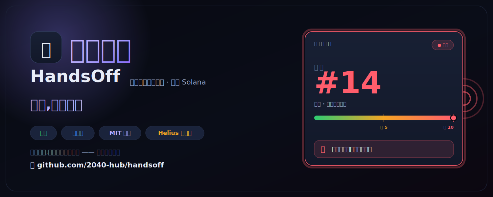
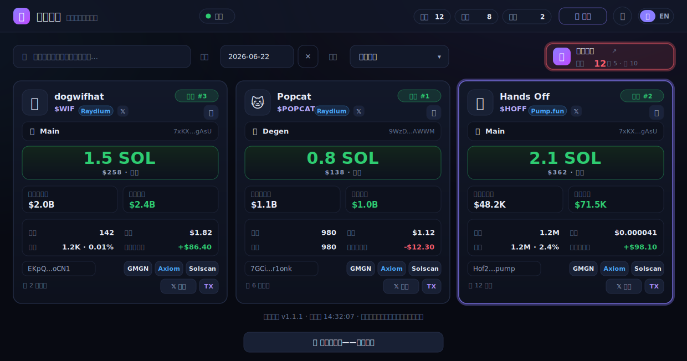
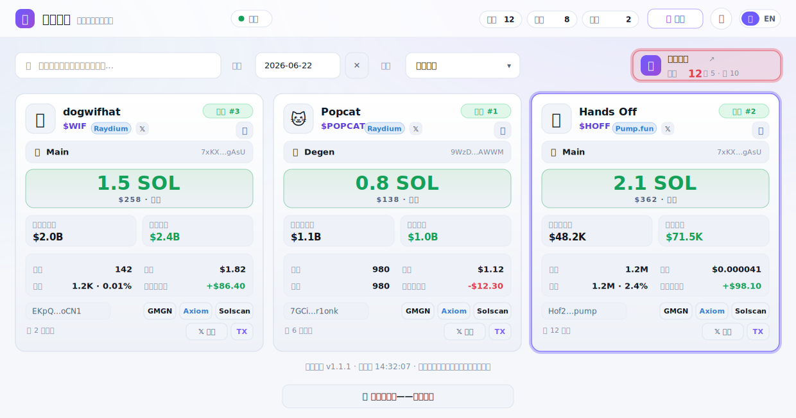
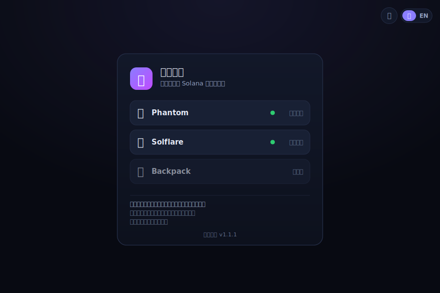

<div align="center">

# 🪓 再买剁手 &nbsp;·&nbsp; HandsOff

**一款面向 Solana 冲土狗玩家的链上「买入自律卫士」。**

它通过免费的 [Helius](https://helius.dev) RPC 监控*你自己*的钱包，把每一笔买入实时
推送成网页卡片——当你今天的买入次数越过你画下的红线时，它会**直接开口说话**，提醒你
把手从钱包上拿开。

[](https://www.python.org/)
[](https://docs.aiohttp.org/)
[](LICENSE)
[](https://solana.com/)

[English](README.md) · [中文](README_cn.md)

<p>
  
</p>

<p>
  
</p>

</div>

---

## 为什么叫「再买剁手」(HandsOff)？

**剁手**是中文网络用语，形容控制不住的冲动消费——*「我要是再买，就把手剁了。」* 在
Solana 上，这种冲动就是凌晨三点冲进你今天第 14 个土狗。

「再买剁手」是一个轻量、自托管的**反 FOMO 小伙伴**。它不会拦截你的交易——而是让你
**没法忽视**它们。每一笔买入都会变成一张科技终端风格的卡片，今日买入计数常驻角落，
而当你冲破**软限制**、继而冲破**硬限制**的那一刻，网页会用中文或英文把提醒**念出来**。
这是你能*听见*的自律。

> 灵感来自某私有监控里专门的「Ray Onyx」钱包买入页面，本项目从零重写为一个干净、
> 单一用途、**完全开源**的工具——没有 Telegram Userbot，没有私有 API，只需一个免费的
> Helius Key。

---

## ✨ 功能特性

- 🃏 **实时买入卡片**——每笔钱包买入一张卡片，按代币分组，含名称、符号、图标、SOL/USD
  金额、代币数量、单价、买入时市值与当前市值、买入后持仓，以及一键直达
  GMGN / Axiom / Solscan / X 搜索 / 交易（TX）链接。
- 🗣️ **软 / 硬语音提醒**——当今日*合计*买入次数（跨所有钱包）达到阈值时，浏览器会通过
  Web Speech API 把提醒念出来。语音从达到阈值的那一刻开始，每多买一笔再念一次，并带有
  **每日上限**，可跨刷新、多标签页与重启保持（同一个买入计数至多播报一次——不刷屏、
  不重复）。
- 🔔 **专属提示音**——新卡片到来时播放，支持「从某代币第 N 笔买入开始」的窗口，以及
  逐卡静音。
- ⚡ **毫秒级更新**——基于 Server-Sent Events 推送，并以 8 秒轮询作为稳健兜底；后台标签页
  通过静音音频保活，提示音 / 语音仍会按时触发（桌面端）。
- 🔭 **纯 Helius 免费套餐**——热路径使用标准 JSON-RPC（每次 1 个 credit），DAS `getAsset`
  获取元数据 / 供应量 / 价格，并以 DexScreener 兜底新发的 pump.fun 代币。无需 Userbot，
  无需付费套餐。
- 🌗 **科技感界面**——明 / 暗主题、中英双语（中 / EN）、搜索、日期筛选、多种排序，并对
  手机端自适应。
- 🔒 **本地且私密**——单个 SQLite 文件，默认绑定 `127.0.0.1`，零遥测。你的 Key 和钱包
  地址永不离开你的机器。
- 🔑 **可选的钱包白名单登录**——用 Solana 钱包签名登录来保护整个页面（Ed25519 消息签名，
  不发交易、不动资金）。只有你加入白名单的地址才能查看页面，其他人一律被重定向到 `/login`。

---

## 🖥️ 界面预览

每一笔买入都会生成一张卡片——代币名称、符号、图标与平台；买入的钱包；本次买入的 SOL / USD
规模；**买入时市值** + **当前市值**；你由此形成的持仓与未实现盈亏；以及一键直达
GMGN / Axiom / Solscan / 𝕏 搜索 / TX 的链接。右上角的**自律面板**实时统计你所有钱包**今日合计**的
买入次数，并逐级升级：中性 → 到达软限制变**琥珀色** → 越过硬限制变**脉冲红色**——也正是网页
「开口播报」提醒的那一刻。*（上方大图为暗色主题，面板已越过硬限制。）*

同一套数据，亮色主题——一键切换：



---

## 🚀 快速开始

### 1. 前置条件

- **Python 3.11+**（在 **3.13.13** 上开发与测试）
- 一个免费的 **Helius API Key**——在 <https://dashboard.helius.dev> 注册并复制 Key。

### 2. 安装

```bash
cd handsoff

# （推荐）创建隔离环境
python3 -m venv venv
source venv/bin/activate          # Windows: venv\Scripts\activate

pip install -r requirements.txt
```

### 3. 配置

```bash
cp config.ini.template config.ini
```

打开 `config.ini`，至少填写：

```ini
[HELIUS]
api_key = 你的_HELIUS_API_KEY

[WALLETS]
addresses = 95jpiZZ8PxYzq4Lfvk8Se2LHsTCMVPL9hXwZp2JBGSHm:主号,
            8Q5bHY9RHtuYcmK7i1qvmYJZN8QXYYaHi9Ruzt2y4L6P:冲号

[DISCIPLINE]
soft_buy_amount = 5
hard_buy_amount = 10
```

### 4. 运行

```bash
python3 handsoff.py
# …或在后台运行：
bash start.sh        # 日志 -> handsoff.log ；停止：bash stop.sh
```

打开 **<http://127.0.0.1:8787>**。先在页面任意处点击一次以解锁声音（浏览器要求先有用户
手势才允许发声），即可开始。

> **首次运行特意保持静默。** 「再买剁手」会记录每个钱包历史当前的末尾位置，只从此刻起为
> *新的*买入生成卡片——不会回放你的历史记录。（设 `seed_silent = false` 可在首次启动时
> 补卡最近历史。）

---

## ⚙️ 配置项参考

所有配置都在 `config.ini` 中。默认值已经足够合理，通常你只需改动
`[HELIUS] api_key`、`[WALLETS] addresses` 以及 `[DISCIPLINE]` 的几个限额。

### `[HELIUS]`

| 配置项 | 默认值 | 说明 |
|---|---|---|
| `api_key` | — | **必填。** 你的 Helius API Key（免费套餐足矣）。 |
| `rpc_url` | `https://mainnet.helius-rpc.com` | 可选的 RPC 地址覆盖（任何 Solana RPC 均可）。 |
| `poll_interval` | `25` | 轮询每个钱包的间隔秒数（最小 5）。 |
| `signatures_limit` | `25` | 每次轮询每页拉取的签名数（1–100）。 |
| `max_pages_per_poll` | `4` | 钱包在两次轮询间非常活跃时的翻页上限。 |
| `metadata_ttl` | `86400` | 代币名称/符号/图标/供应量缓存有效期（秒）。 |
| `price_ttl` | `300` | 代币价格/市值缓存有效期（秒）。 |
| `price_refresh_interval` | `300` | 刷新近期活跃代币当前市值的频率。 |
| `seed_silent` | `true` | 首次运行跳过历史（避免卡片刷屏）。 |
| `min_sol_amount` | `0.0001` | 忽略小于该 SOL 数额的「买入」（粉尘/仅手续费噪声）。 |

### `[WALLETS]`

| 配置项 | 说明 |
|---|---|
| `addresses` | 逗号分隔的 `地址:昵称` 列表——**你自己的**钱包，昵称可选。自律计数是这些钱包今天买入次数的**合计**。 |

### `[DISCIPLINE]`  — 整个工具的精髓

| 配置项 | 默认值 | 说明 |
|---|---|---|
| `soft_buy_amount` | `5` | 温和的「保持理性」提醒阈值（0 = 关闭）。 |
| `hard_buy_amount` | `10` | 强硬的「快收手！」阈值（0 = 关闭）。 |
| `soft_max_alerts` | `0` | 每天软提醒最多播报次数（**0 = 不限**）。 |
| `hard_max_alerts` | `0` | 每天硬提醒最多播报次数（**0 = 不限**）。 |
| `enable_duplicate_buy` | `true` | 今天重复买入**同一代币（CA）**是否每次都计入？`true`（默认）= 每笔都算，同一 CA 买 3 次记 **3** 次。`false` = 每个不同 CA 只记 **1** 次，重复加仓已持有的仓位不会逼近阈值，只有买入**新代币**才会累加。 |
| `label` | 自动 | 面板标签（默认取单个钱包昵称，或「My Wallets」）。 |
| `panel_url` | 自动 | 面板点击跳转的 GMGN 链接（默认取第一个钱包）。 |

### `[CHIME]`

| 配置项 | 默认值 | 说明 |
|---|---|---|
| `enabled` | `true` | 是否播放新卡片提示音。 |
| `start_seq` | `1` | 从某代币的第 N 笔买入开始响铃。 |
| `max` | `5` | 每个代币最多响铃次数。 |

### `[WEB]`

| 配置项 | 默认值 | 说明 |
|---|---|---|
| `host` | `127.0.0.1` | 绑定地址。除非启用下方钱包登录（或自行加代理/鉴权），**请保持回环地址**。 |
| `port` | `8787` | 网页端口。 |
| `db_path` | `handsoff.db` | SQLite 文件（买入卡片 + 语音账本）。 |
| `enable_auth` | `false` | 用 Solana 钱包白名单登录保护网页（见 [钱包登录](#-钱包登录可选)）。 |
| `whitelist_wallet_lists` | — | 逗号分隔的钱包地址白名单。为空且 `enable_auth=true` = 任何人都无法登录。 |
| `session_secret` | — | 签发会话令牌的密钥。`enable_auth=true` 时**必填**（≥16 位随机字符）。生成：`python3 -c "import secrets; print(secrets.token_urlsafe(48))"` |
| `session_ttl` | `604800` | 会话有效期（秒，默认 7 天）。 |
| `nonce_ttl` | `300` | 登录挑战（nonce）有效期（秒）。 |

### `[GENERAL]`

| 配置项 | 默认值 | 说明 |
|---|---|---|
| `log_level` | `INFO` | `DEBUG` / `INFO` / `WARNING` / `ERROR`。 |

---

## 🗣️ 自律语音的工作原理

语音是「再买剁手」的核心，并且经过精心设计，做到**有用而不烦人**：

1. **在阈值处触发。** 今日合计买入次数*等于* `soft_buy_amount` 的那一刻播放第一条软提醒
   （随后在 `hard_buy_amount` 处播放硬提醒）。
2. **每多买一笔再播一次**——越过红线后的每一次加仓都会再唠叨一遍，让压力恰好在你失控时
   逐步升级。
3. **永不重复同一个计数。** 刷新页面、开三个标签页、凌晨两点重启进程——某个买入计数**至多
   播报一次**。播报账本持久化在 SQLite 中，且计数由服务端原子地重新计算与认领。
4. **每日上限。** `soft_max_alerts` / `hard_max_alerts` 限制每个层级每天的播报次数（`0` =
   不限）。硬提醒始终优先于软提醒。
5. **本地午夜重置。** 明天又是崭新的一天。

> **什么算一次「买入」？** 默认每一笔都算——同一个代币分十次加仓就是十次买入。如果你更想
> 衡量**广度**，把 `enable_duplicate_buy` 设为 `false`：此时每个代币只记**一次**，计数就变成
> 「我今天冲了多少个不同的币？」，重复加仓同一仓位不会把你推向阈值。（无论哪种设置，顶部的
> **Buys** 统计始终显示原始的成交笔数。）

面板会同步呈现这一过程：中性 → 软限制时**变黄** → 硬限制时**红色脉冲**。当声音被静音或
浏览器尚未解锁时，每个层级还会弹出一次性的视觉提示作为兜底。

> **浏览器把声音锁在用户手势之后。** 在页面上点击/按键一次（或切换 🔊 按钮）即可解锁提示音
> 与语音。在此之前，「再买剁手」保持静默并在每次轮询时重试，因此不会丢失任何提醒——它只是
> 在等待授权。

---

## 🔑 钱包登录（可选）

默认情况下网页在其绑定地址上**开放访问**（因此请保持在 `127.0.0.1`）。如果你想把它暴露出去
——在局域网、VPS 或隧道后面——可以用 **Solana 钱包白名单登录**来保护整个页面：只有你列出的
地址才能登录并查看。没有密码；钱包通过**签名一条消息**来证明归属（不发交易、不动资金）。

<div align="center">

</div>

**启用步骤：**

1. 安装鉴权依赖（已在 `requirements.txt` 中）：
   ```bash
   pip install pynacl base58
   ```
2. 生成一个强随机的 `session_secret`（用于签发会话 Cookie 的 HMAC 密钥——以下任选其一，
   每条都会打印一个长随机字符串）：
   ```bash
   python3 -c "import secrets; print(secrets.token_urlsafe(48))"   # 推荐
   openssl rand -base64 48
   head -c 48 /dev/urandom | base64
   ```
   长度必须 ≥16 字符（以上命令生成约 64 字符）。请妥善保密——切勿提交它（`config.ini` 已被
   git 忽略）。重启时请沿用**同一个**密钥以保留已有会话；一旦更换，所有会话立即失效（所有人
   需重新登录）。
3. 填写 `config.ini`：
   ```ini
   [WEB]
   enable_auth = true
   whitelist_wallet_lists = 95jpiZZ8PxYzq4Lfvk8Se2LHsTCMVPL9hXwZp2JBGSHm,
                            8Q5bHY9RHtuYcmK7i1qvmYJZN8QXYYaHi9Ruzt2y4L6P
   session_secret = <粘贴上一步生成的密钥>
   ```
4. 重启。访问页面 → 会被重定向到 `/login`，在那里连接 Phantom / Solflare / Backpack
   （桌面扩展，或手机上钱包的内置浏览器）并批准签名。一个签名的 HMAC 会话 Cookie（默认 7 天）
   让你保持登录。

**工作原理：** nonce → 钱包签名登录消息 → 服务端验证 Ed25519 签名**并且**确认地址在白名单中
→ 签发无状态的 HMAC 会话令牌。白名单在**每个请求**上都会重新校验，因此移除某地址（并重启）
会立即吊销其访问权限，即使该钱包还持有有效令牌。

**默认 Fail-closed（出错即关闭）**——若 `enable_auth = true` 但鉴权依赖缺失，或
`session_secret` 未设置 / 仍是默认值 / 短于 16 字符，「再买剁手」会**拒绝提供网页**（而不是
提供一个未加保护或可被伪造的页面），同时轮询继续运行并持久化买入。白名单为空意味着*任何人*
都无法登录（会记录一条警告）。

> 即使开启了钱包登录，对超出可信局域网的访问也请优先使用 TLS 反向代理或 SSH 隧道——会话
> Cookie 应当走 HTTPS 传输。见 [部署](#-部署)。

---

## 🧭 实现原理

```
        ┌──────────────────────────── handsoff.py（单 asyncio 事件循环）─────────────────────────┐
        │                                                                                        │
  Helius │  轮询循环 ──getSignaturesForAddress──▶ 新签名 ──getTransaction(jsonParsed)──▶ 解析     │
  免费   │      │                                                              │  （是买入？）    │
  RPC ◀──┤      └── getAsset / DexScreener（元数据、供应量、价格）◀────────────┘                  │
        │                              │                                                          │
        │                              ▼                                                          │
        │                       SQLite 存储 (signals · tokens · voice_alerts)                     │
        │                              │                                                          │
        │        aiohttp 网页服务 ◀────┘  ── /api/signals /api/stats /api/config /api/voice/claim  │
        │              │                  ── /api/stream（Server-Sent Events：「有新买入！」）     │
        └──────────────┼─────────────────────────────────────────────────────────────────────────┘
                       ▼
                  你的浏览器  ──渲染卡片 · 播放提示音 · 「念出」软/硬提醒
```

- **买入识别**采用通用、可移植的标准 RPC 路径：读取 `meta.pre/postTokenBalances` 与
  `pre/postBalances`，找出 SPL 代币*流入*、同时 SOL（或 WSOL/USDC）*流出*的情形。WSOL 的
  包装/解包、手续费支付者与持有者不一致、多跳路由、失败交易等都已妥善处理。
- **SOL 花费的测算更稳健。**账户列表会与余额数组严格一一对齐，并把地址查找表（ALT）加载的
  账户一并纳入——这样即使买入钱包只以 ALT 账户形式出现（路由器 / 交易机器人的*版本化*交易里
  极为常见），也能从正确的槽位读取它的 lamport 变化。当钱包自身余额只显示手续费级别的「粉尘」
  时（即由机器人或第三方代付的买入），金额会改从**对手方**还原（流入打底曲线的 SOL，或流入 AMM
  池子的 WSOL），从而让买入金额、单价与市值反映真正易手的 SOL，而非塌缩成约 100 倍偏小的数值。
  只要钱包*付出了*某一条腿——原生 SOL **或**包装后的 SOL（WSOL）——还原逻辑就会触发，因此即使
  一笔买入的 SOL 被包装、且原生找零 / 租金被退回（钱包自身原生余额从未净减少），它依然能被识别；
  收到的 WSOL 按**每个代币账户**分别测算，所以即便某个池子持有多个 WSOL 账户也无法把这条腿藏掉。
  即便是**用稳定币（USDC/USDT）出资**的买入（聚合器把稳定币换成 SOL 再打入打底曲线），也会按真正
  流入曲线的那笔 SOL 计量，而不是手续费级别的原生粉尘；而*直接*用稳定币换代币、根本没有 SOL 腿的
  买入，则按花掉的稳定币计价。被动到账（空投、转入）与卖出都没有付出任何资金，绝不会被当作买入计价。
- **元数据与价格**来自 Helius DAS `getAsset`（名称、符号、图标、精度、原始供应量、缓存价格），
  并以 **DexScreener** 兜底新发 pump.fun 代币的最新市值。
- **买入时刻的数值严格由该笔买入推导**——存储的单价与市值只来自你花费的 SOL ÷ 收到的代币
  （× SOL/USD）× 流通供应量，**绝不**用之后/实时价格替代，因此卡片上的「买入时市值」不会悄悄
  漂移成当前值。最新的*当前*市值另行单独展示（取自代币缓存）。

> **已知限制（刻意保守处理）。**少数较为特殊的路由仍会*偏低*归因（让买入停留在粉尘值），而
> 不会过度归因，因为要精确计价需要链上内部指令（CPI）的关联信息；它们被刻意保留为保守处理：
> (1) SOL 腿被包装进一个**在同一笔交易内即被关闭的临时 WSOL 账户**（没有 post 余额可读）；
> (2) 经由中间 WSOL 腿路由的**币换币**交换（钱包花的是代币而非 SOL）；(3) 一笔买入与一笔**更大的
> 无关 SOL 转移**被打包进同一交易，可能导致过度归因。解析器由 `test_parse_buy.py` 覆盖（为每种
> 形态准备的合成交易夹具，运行 `python3 test_parse_buy.py`）。由旧版解析器写入的历史行，可用
> `repair.py` 原地重算——重新拉取 + 重新解析 + 重写：
>
> ```bash
> python3 repair.py                 # 试运行：扫描粉尘级别的买入
> python3 repair.py --apply         # 写入修正（先备份 handsoff.db）
> python3 repair.py --ca <MINT>     # 重算某个代币的所有买入
> python3 repair.py --sig <SIG>     # 重算单笔交易
> ```

---

## 📦 部署

「再买剁手」是一个长期运行的 Python 进程外加一个本地网页服务。任选适合你的方式。

### 方式 A —— 后台脚本（最简单）

```bash
bash start.sh      # nohup 后台运行，日志写入 handsoff.log
bash stop.sh       # 停止
bash restart.sh    # 停止 + 启动
```

`start.sh` 会自动优先使用 `./venv` 或 `./.venv`，否则回退到 `python3`。

### 方式 B —— systemd（服务器推荐）

创建 `/etc/systemd/system/handsoff.service`：

```ini
[Unit]
Description=HandsOff (再买剁手) buy-discipline guard
After=network-online.target
Wants=network-online.target

[Service]
Type=simple
User=youruser
WorkingDirectory=/opt/handsoff
ExecStart=/opt/handsoff/venv/bin/python /opt/handsoff/handsoff.py -c /opt/handsoff/config.ini
Restart=on-failure
RestartSec=5

[Install]
WantedBy=multi-user.target
```

```bash
sudo systemctl daemon-reload
sudo systemctl enable --now handsoff
sudo journalctl -u handsoff -f          # 跟随日志
```

### 方式 C —— tmux / screen（快速、可交互）

```bash
tmux new -s handsoff
python3 handsoff.py
# 分离：Ctrl-b d ；重新连接：tmux attach -t handsoff
```

### 远程访问（并保持安全）

「再买剁手」特意绑定在 `127.0.0.1`。若要从其他设备访问，你有两种选择：开启内置的
[钱包白名单登录](#-钱包登录可选)，以及/或者用隧道/代理套在前面。**请勿**在没有其中至少一项
的情况下直接暴露端口。推荐：

- **SSH 隧道（最简单、最安全）：**
  ```bash
  ssh -N -L 8787:127.0.0.1:8787 youruser@your-server
  # 然后在本机打开 http://127.0.0.1:8787
  ```
- **带鉴权的反向代理（nginx + Basic Auth + TLS）：** 用 nginx 套在前面，加 `auth_basic`，
  终止 HTTPS（Let's Encrypt），并代理到 `127.0.0.1:8787`。为保证 SSE 正常工作，请关闭
  代理缓冲：
  ```nginx
  location / {
      proxy_pass http://127.0.0.1:8787;
      proxy_http_version 1.1;
      proxy_set_header Connection '';
      proxy_buffering off;            # /api/stream（SSE）必需
      auth_basic "HandsOff";
      auth_basic_user_file /etc/nginx/.htpasswd;
  }
  ```

> 🔐 **切勿在既没有钱包登录、也没有代理 + 鉴权的情况下绑定 `host = 0.0.0.0`。** 任何能访问
> 开放端口的人都能看到你钱包的动向。

---

## 💸 免费套餐与速率限制

「再买剁手」的设计目标就是舒适地运行在 Helius **免费套餐**内（每月 100 万 credits，
10 RPC 次/秒）：

- 热路径使用**标准 RPC**（`getSignaturesForAddress` + `getTransaction`），每次
  **1 credit**——比 Enhanced Transactions API 便宜约 100 倍。
- 元数据**每个新代币只取一次**（`getAsset`，10 credits）并缓存；价格以较慢的节奏刷新。
- 内置限流器在 HTTP 429 时以指数退避，保证你不超过每秒上限。

**经验法则：** 在 `poll_interval = 25` 下监控少量钱包，每月仅消耗几十万 credits——远在免费
额度之内。要监控大量高频钱包？请调大 `poll_interval`，或升级 Helius 付费套餐。

---

## 🔐 数据与隐私

- 一切都在**本地**运行。唯一的外部请求是 Helius 以及（作为价格兜底的）DexScreener。
- 买入历史与语音账本保存在单个 SQLite 文件（`handsoff.db`）中；删除它即可清空所有数据。
- `config.ini`（你的 API Key + 钱包）以及 `*.db` / `*.log` 都已被 **git 忽略**，避免误传。
- 无统计分析、无账户、无任何「回家上报」。

---

## 🩺 故障排查

| 现象 | 解决办法 |
|---|---|
| **没有语音 / 没有提示音** | 在页面点击一次（或切换 🔊）以解锁声音——浏览器要求用户手势。检查 🔊 按钮未处于静音。 |
| **页面打开但没有卡片** | 新买入只在启动*之后*出现（不回放历史）。做一笔小额买入，或设 `seed_silent = false`。检查 `handsoff.log`。 |
| **`No Helius api_key configured`** | 在 `config.ini` 的 `[HELIUS]` 下填写 `api_key`。 |
| **`No wallets configured`** | 在 `[WALLETS] addresses` 下至少添加一个 `地址:昵称`。 |
| **市值显示「—」** | DAS 可能尚未为新发代币定价；下次价格刷新会回填（DexScreener 兜底）。 |
| **日志出现 HTTP 429** | 触发了速率限制——调大 `poll_interval` / `price_refresh_interval`，或减少钱包数量。 |
| **端口被占用** | 修改 `[WEB] port`，或停止占用端口的进程。 |
| **手机访问不了** | 使用 SSH 隧道或带鉴权的反向代理（见「部署」）。不要暴露 `0.0.0.0`。 |

需要详细诊断时，把 `log_level` 设为 `DEBUG`。

---

## 🗂️ 项目结构

```
discipline/
├── handsoff.py            # 主程序：配置 + Helius 轮询 + 买入记录 + 启动引导
├── helius.py              # Helius/Solana RPC 客户端 + DAS 元数据 + 买入解析器
├── repair.py              # 重新拉取 + 重新解析 + 重写计价错误的历史买入
├── debug_tx.py            # 只读：导出单笔交易结构 + parse_buy 对其的解析结果
├── test_parse_buy.py      # 买入解析器的合成交易夹具测试
├── config.ini.template    # 复制为 config.ini 并填写
├── requirements.txt
├── start.sh / stop.sh / restart.sh
├── auth/                  # 可选的钱包白名单登录（需要 pynacl + base58）
│   ├── whitelist.py       # 地址白名单
│   ├── session.py         # nonce 存储 + HMAC 会话令牌 + Ed25519 验签
│   ├── handlers.py        # /api/auth/{nonce,verify,me,logout}
│   └── middleware.py      # auth_required 门禁 + 会话 Cookie 提取
├── web_module/
│   ├── store.py           # SQLite：signals + tokens 缓存 + 语音播报账本
│   ├── server.py          # aiohttp JSON API + SSE（启用登录时受保护）
│   └── events.py          # SSE 发布/订阅枢纽
├── static/
│   ├── pages/  discipline.html · login.html
│   ├── css/discipline.css
│   └── js/  discipline.js · login.js · i18n.js · theme.js
└── docs/                  # 产品效果图（SVG）
```

---

## 🧱 技术栈

- **Python 3.13** · `asyncio` · [`aiohttp`](https://docs.aiohttp.org/) · 标准库 `sqlite3`
- **Helius** 免费 RPC + DAS · **DexScreener** 价格兜底
- 可选钱包登录：`pynacl`（Ed25519）+ `base58` · 无状态 HMAC 会话令牌
- 原生 JS 前端（无需构建）· Web Speech API · Server-Sent Events

---

## 🤝 参与贡献

欢迎提交 Issue 与 PR。请保持依赖精简、对免费套餐友好。若改动任何前端资源，请同步提升
`discipline.js` 中的 `FRONTEND_VERSION` 以及 `discipline.html` 里对应的 `?v=N` 查询参数
（二者需保持一致）。

---

## 📜 许可证

基于 **MIT 许可证**发布——见 [`LICENSE`](LICENSE)。

---

## ⚠️ 免责声明

「再买剁手」是个人自律辅助工具，**并非**投资建议，且与 Helius、GMGN、Axiom、DexScreener
或 Solana 无任何关联。它只*读取*公开的链上数据——永远无法接触你的私钥，也永远不会发起任何
交易。请理性交易。还有，你懂的，把手从钱包上拿开。🪓
